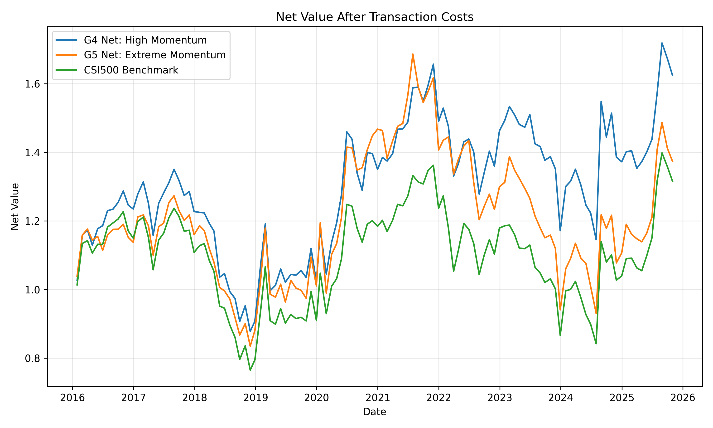
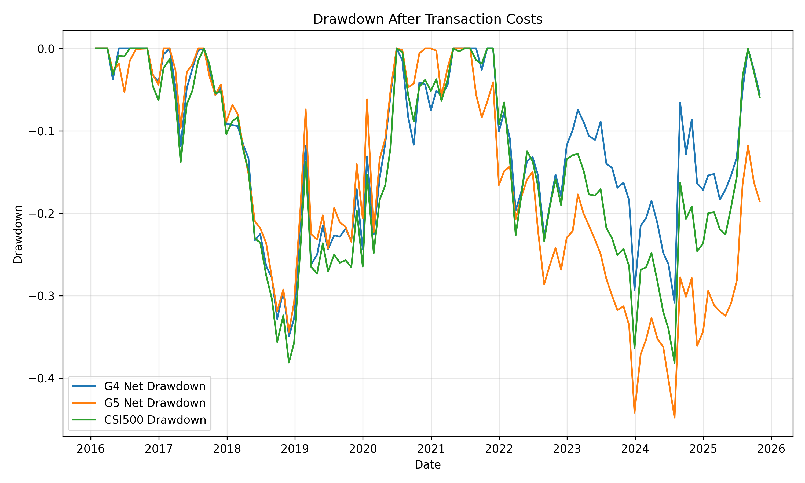
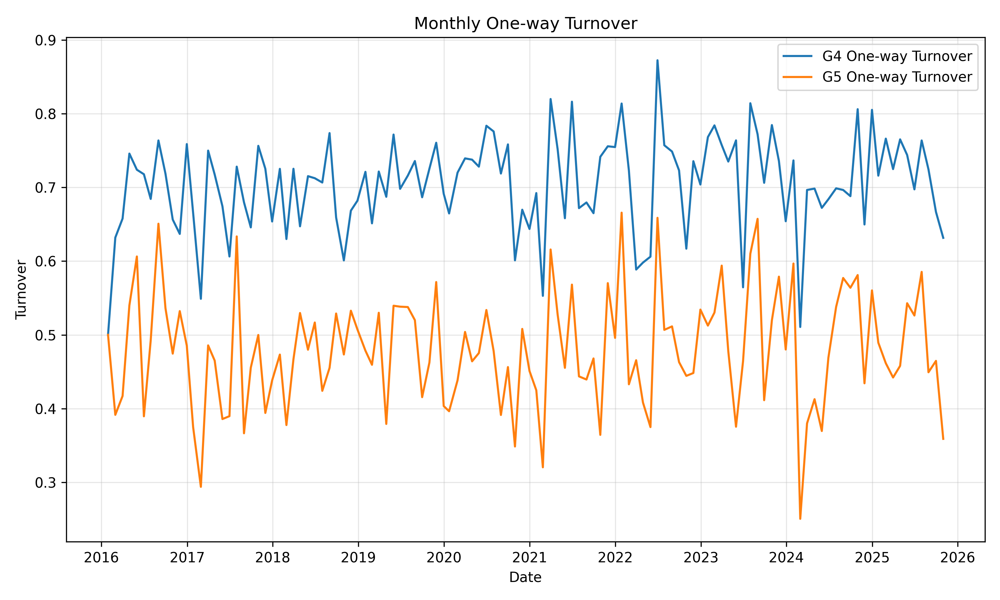
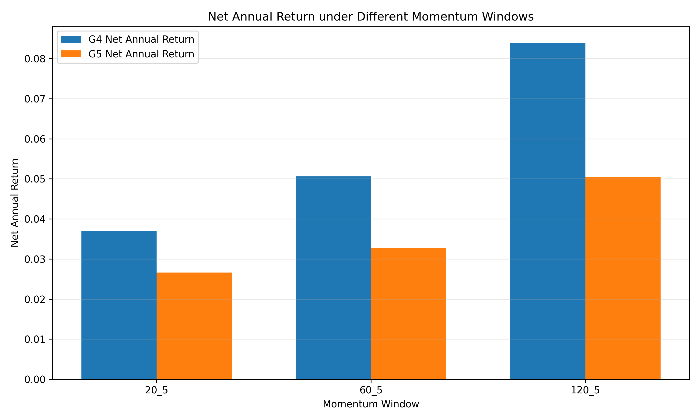
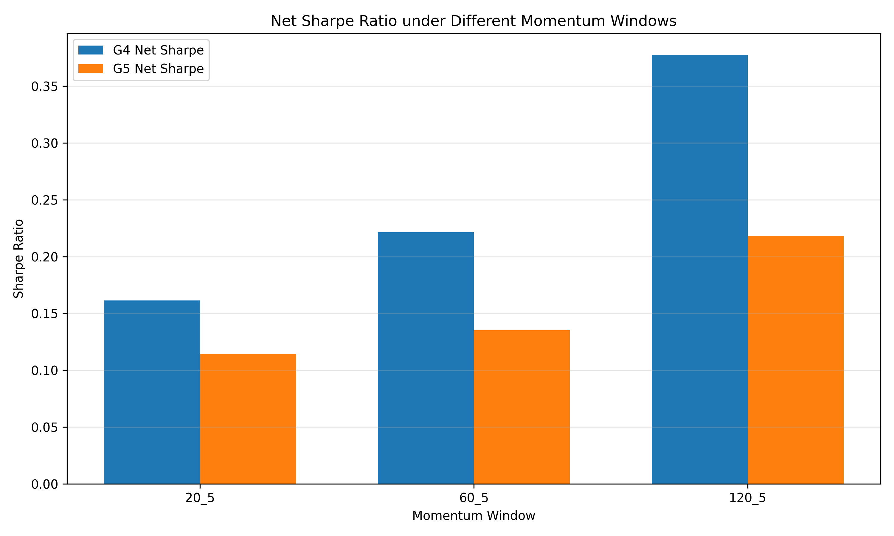
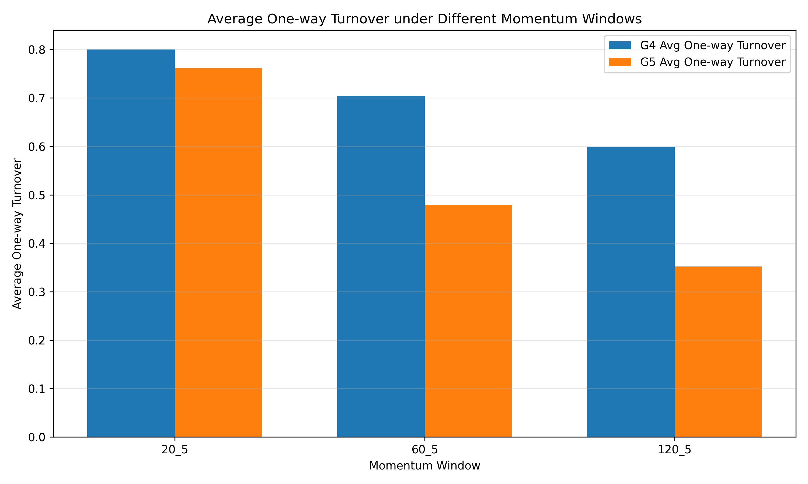
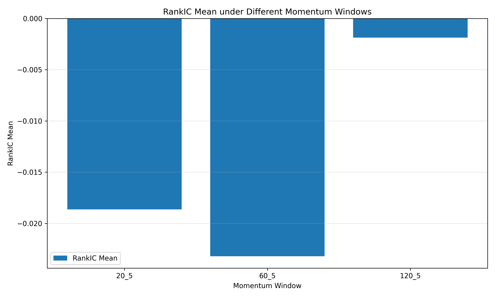

# A-Share Cross-sectional Momentum Research

本项目研究 A 股市场中的横截面动量效应，以上证中证500成分股为股票池，构建月度调仓的动量分组组合，并完成因子构造、分组回测、持仓权重回测、交易成本处理、换手率分析、风险指标评价与参数稳健性检验。

本项目的目标不是证明存在一个可以直接实盘使用的“赚钱策略”，而是展示一套完整的量化研究流程：

```text
数据获取 → 数据清洗 → 因子构造 → 分组回测 → 组合构建 → 交易成本 → 风险评价 → 稳健性检验 → 研究报告
```

## 1. Research Question

动量效应通常指过去一段时间表现较好的股票，在未来一段时间内可能继续表现较好。本项目重点研究：

1. 中证500成分股中是否存在横截面动量效应？
2. 极端高动量股票是否一定优于其他分组？
3. 动量排名 60%-80% 的“温和高动量”组合是否比动量最高 20% 的“极端高动量”组合更加稳健？
4. 在考虑交易成本和换手率后，动量组合的表现是否仍然有效？
5. 结论是否依赖于单一动量窗口参数？

## 2. Data and Universe

* 股票池：中证500成分股
* 样本区间：2016-01 至 2025-12
* 调仓频率：月度调仓
* 数据来源：聚宽研究平台
* 价格处理：前复权收盘价
* 过滤条件：

  * 剔除 ST 股票
  * 剔除信号日停牌股票
  * 剔除上市不足 180 天的新股
* 数据说明：由于数据授权限制，本仓库不上传完整原始行情数据。用户可参考 `jq_export/` 中的脚本在聚宽环境中自行导出数据。

## 3. Factor Definition

本项目使用动量因子：

```text
momentum_L_5 = close[t-5] / close[t-L] - 1
```

其中：

* `L` 表示动量回看窗口；
* `5` 表示剔除最近 5 个交易日，用于降低短期反转影响；
* 本项目测试了三个窗口：

  * `momentum_20_5`
  * `momentum_60_5`
  * `momentum_120_5`

每个月按照因子值从低到高将股票分为 5 组：

| 分组 | 含义                  |
| -- | ------------------- |
| G1 | 动量最低 20%            |
| G2 | 动量较低                |
| G3 | 中等动量                |
| G4 | 动量排名 60%-80%，即温和高动量 |
| G5 | 动量最高 20%，即极端高动量     |

## 4. Backtest Design

* 组合构造：组内等权持有
* 建仓方式：信号日后一个交易日建仓，避免未来函数
* 持有期：持有至下一个月度调仓日
* 交易成本：每交易 1 元资产成本设为 0.1%，用于近似手续费、滑点和冲击成本
* 换手率计算：基于调仓前漂移权重与目标权重之间的差异计算
* 主要评价指标：

  * 总收益
  * 年化收益
  * 年化波动率
  * 夏普比率
  * 最大回撤
  * 胜率
  * 平均单边换手率
  * RankIC

## 5. Main Results

在 `momentum_60_5` 设定下，G4 与 G5 的扣费后表现如下：

| Portfolio | Total Return | Annual Return | Sharpe | Max Drawdown | Win Rate |
| --------- | -----------: | ------------: | -----: | -----------: | -------: |
| G4 Net    |       62.39% |         5.05% |  0.221 |      -34.96% |   54.24% |
| G5 Net    |       37.33% |         3.28% |  0.136 |      -44.81% |   51.69% |

换手率结果：

| Portfolio | Avg Trade Value | Avg One-way Turnover | Avg Transaction Cost |
| --------- | --------------: | -------------------: | -------------------: |
| G4        |          1.4090 |               70.45% |              0.1409% |
| G5        |          0.9589 |               47.95% |              0.0959% |

主要发现：

1. 极端高动量组 G5 并未表现出最优收益。
2. 温和高动量组 G4 在收益、夏普和最大回撤方面均优于 G5。
3. G4 的换手率高于 G5，因此其收益对交易成本更加敏感。
4. RankIC 均值整体较弱，说明该因子并非稳定的单调排序因子。
5. 结果更像是“极端高动量股票存在反转或拥挤风险”，而不是传统意义上的“动量越高越好”。

## 6. Robustness Test

为了检验结论是否依赖单一参数，本项目测试了 20日、60日、120日三个动量窗口。

| Factor         | G4 Net Annual Return | G4 Net Sharpe | G4 Max Drawdown | G5 Net Annual Return | G5 Net Sharpe | G5 Max Drawdown |
| -------------- | -------------------: | ------------: | --------------: | -------------------: | ------------: | --------------: |
| momentum_20_5  |                3.70% |         0.161 |         -42.12% |                2.66% |         0.114 |         -40.23% |
| momentum_60_5  |                5.05% |         0.221 |         -34.96% |                3.28% |         0.136 |         -44.81% |
| momentum_120_5 |                8.39% |         0.377 |         -32.06% |                5.04% |         0.218 |         -43.33% |

稳健性结论：

1. 在三个动量窗口下，G4 的扣费后年化收益均高于 G5。
2. 在三个动量窗口下，G4 的扣费后夏普比率均高于 G5。
3. 120日动量窗口下，G4 的收益风险比表现最好。
4. 动量窗口越长，组合换手率整体下降，交易成本压力减弱。
5. 温和高动量优于极端高动量的现象在不同窗口下具有一定稳健性。

## 7. Figures

### Net Value after Transaction Costs



### Drawdown after Transaction Costs



### Turnover Comparison



### Robustness: Net Annual Return



### Robustness: Sharpe Ratio



### Robustness: Turnover



### Robustness: RankIC



## 8. Project Structure

```text
A-Share-Momentum-Strategy-Research/
│
├── README.md
├── requirements.txt
├── .gitignore
│
├── data/
│   ├── README.md
│   ├── raw/
│   └── processed/
│
├── jq_export/
│   └── export_factor_return_panel.py
│
├── notebooks/
│   └── 01_factor_analysis.ipynb
│
├── reports/
│   ├── momentum_strategy_report.md
│   └── figures/
│
└── src/
```

## 9. Limitations

本项目仍有以下局限：

1. 当前只使用中证500成分股，尚未扩展至沪深300、中证1000或全A股票池。
2. 当前没有做行业中性化和市值中性化，因此组合收益可能受到风格暴露影响。
3. 当前使用简化交易成本假设，没有进一步建模涨跌停无法成交、冲击成本和真实盘口流动性。
4. 当前回测为月频中低频研究，不能直接等同于可实盘策略。
5. 当前因子 RankIC 较弱，说明动量因子的单调排序能力有限。

## 10. Future Work

后续可以继续扩展：

1. 测试沪深300、中证1000和全A股票池；
2. 加入行业和市值中性化；
3. 比较动量、反转、波动率、换手率等多个因子；
4. 构建多因子模型；
5. 使用滚动样本外验证；
6. 加入更真实的交易限制和成交假设。

## 11. Key Takeaway

本项目发现，在中证500成分股样本中，极端高动量组并未稳定占优。相比动量最高 20% 的 G5 组合，动量排名 60%-80% 的 G4 组合在多个动量窗口下展现出更好的扣费后收益、夏普比率和回撤控制。该结果提示，A 股横截面动量中可能存在极端动量反转或交易拥挤现象，温和高动量组合比极端高动量组合更值得进一步研究。
